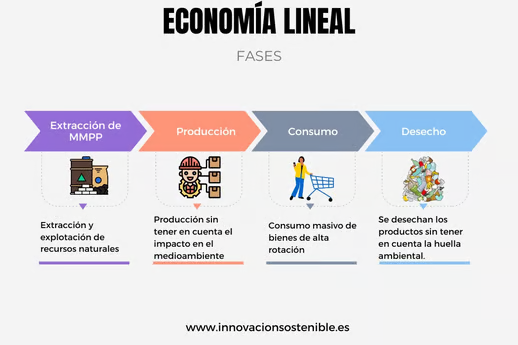
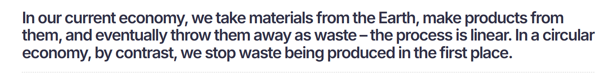
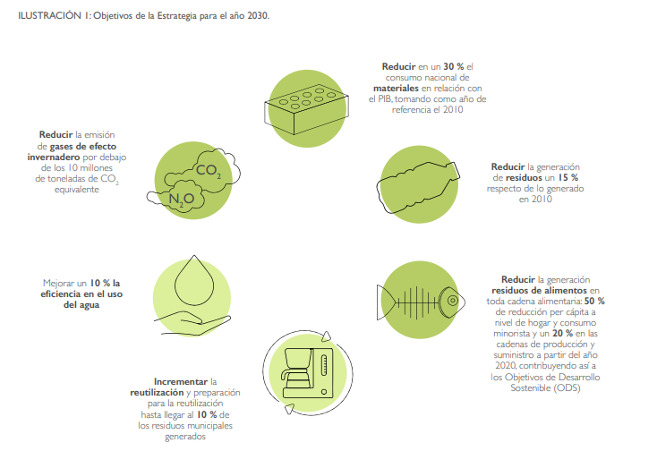
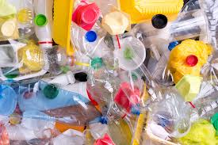
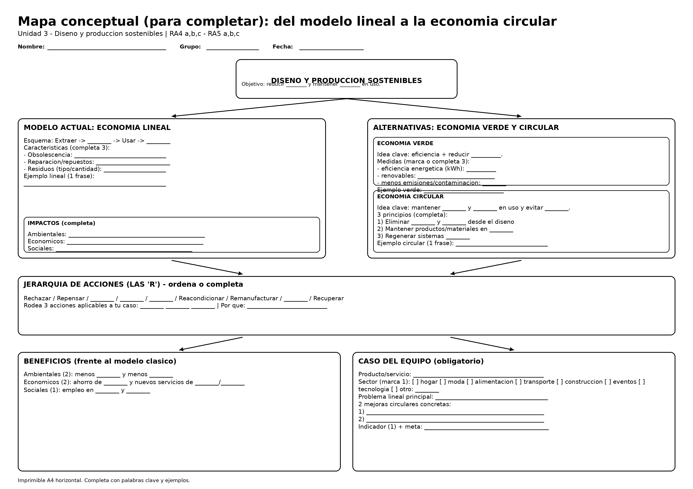

## Sesión 1 - Modelo Lineal, Economía Verde y Circular

**SOSTENIBILIDAD. UD3. DISEÑO Y PRODUCCIÓN SOSTENIBLES**

**Criterios:** RA4 a, b, c ·

---

# 1️⃣-Del modelo lineal a la economía circular

## 1) Modelo: economía lineal

1) Modelo actual de producción y consumo: economía lineal

El modelo lineal sigue el patrón **extraer → fabricar → usar → tirar** (“take-make-waste”). Su lógica es maximizar ventas de unidades nuevas, aunque eso aumente consumo de recursos y residuos. ([ellenmacarthurfoundation.org](https://www.ellenmacarthurfoundation.org/the-circular-economy-in-detail-deep-dive?utm_source=chatgpt.com "The circular economy in detail"))



**Rasgos característicos (para identificarlo en cualquier ámbito):**

* **Diseño para reemplazo** (vida útil corta, reparaciones difíciles o caras).
* **Baja reutilización** (productos y materiales salen rápidamente del sistema).
* **Residuos al final** (se gestiona “lo que sobra” en lugar de evitar que aparezca).
* **Impactos ocultos** (ambientales y sociales fuera del precio final).

**Ejemplos “lineales” muy sencillos:**

* **Moda:** camiseta barata que se deforma rápido → se tira; nuevo ciclo de compra.
* **Alimentación:** envases monodosis para consumo diario.
* **Construcción:** derribo sin desmontaje selectivo → escombros mezclados.
* **Transporte:** uso sistemático de coche privado para trayectos cortos por hábito.
* **Tecnología:** móvil con batería sellada y repuestos no disponibles (se sustituye el equipo).

---

## 2) Economía verde

¿qué es y cómo se reconoce?

**Definición (ONU/PNUMA):** una economía verde (inclusiva) busca **mejorar el bienestar y la equidad** mientras  **reduce riesgos ambientales y escasez ecológica** . ([UNEP - UN Environment Programme](https://www.unep.org/explore-topics/green-economy/about-green-economy?utm_source=chatgpt.com "About green economy"))


**Qué suele implicar en la práctica (sin salir aún de lo “lineal”):**

* Eficiencia energética y de materiales (hacer “lo mismo” con menos).
* Sustitución por energías renovables.
* Reducción de contaminación, emisiones y toxicidad.
* Mejora de gestión ambiental en procesos (medición, objetivos, control).

**Ejemplos (verde) en distintos sectores:**

* **Hostelería:** equipos eficientes + reducción de desperdicio alimentario.
* **Industria:** optimizar consumo de agua/energía en una línea de producción.
* **Agricultura:** riego eficiente y reducción de fertilizantes de alto impacto.
* **Centro educativo:** bajar impresión, controlar consumos, separar residuos correctamente.

> Importante:  **“verde” no siempre es “circular”** . Puede reducir impactos, pero si el producto sigue siendo “usar y tirar”, no hemos cerrado ciclos.

---

## 3) Economía circular:

¿qué es, principios y procesos típicos?

**Definición (Ellen MacArthur Foundation):** es un sistema en el que **los materiales no se convierten en residuos** y  **la naturaleza se regenera** ; los productos y materiales se mantienen en circulación mediante  **mantenimiento, reutilización, reparación, reacondicionamiento, remanufactura, reciclaje y compostaje** . ([ellenmacarthurfoundation.org](https://www.ellenmacarthurfoundation.org/topics/circular-economy-introduction/overview?utm_source=chatgpt.com "The Circular Economy | Definition &amp; Model Explained"))

**Tres ideas clave para explicarlo en clase (muy claras):**

1. **Eliminar residuos y contaminación desde el diseño**
2. **Mantener productos y materiales en uso**
3. **Regenerar sistemas naturales** ([ellenmacarthurfoundation.org](https://www.ellenmacarthurfoundation.org/eliminate-waste-and-pollution?utm_source=chatgpt.com "Eliminate Waste &amp; Pollution | Reduce &amp; Prevent"))

**Qué NO es:**

* “Circular”  **no es solo reciclar** . El reciclaje es útil, pero suele ser **última opción** si ya no puedes  **reutilizar, reparar o reacondicionar** . ([ellenmacarthurfoundation.org](https://www.ellenmacarthurfoundation.org/topics/circular-economy-introduction/overview?utm_source=chatgpt.com "The Circular Economy | Definition &amp; Model Explained"))

**Marco europeo (para contextualizar):**
La UE impulsa la circularidad con medidas que abarcan  **todo el ciclo de vida** , incluyendo  **diseño del producto** , prevención de residuos y mantener recursos en la economía el mayor tiempo posible. ([Environment](https://environment.ec.europa.eu/strategy/circular-economy_en?utm_source=chatgpt.com "Circular Economy - Environment - European Commission"))



<iframe width="1040" height="586" src="https://www.youtube.com/embed/NBEvJwTxs4w" title="Ellen MacArthur on the basics of the circular economy" frameborder="0" allow="accelerometer; autoplay; clipboard-write; encrypted-media; gyroscope; picture-in-picture; web-share" referrerpolicy="strict-origin-when-cross-origin" allowfullscreen></iframe>

---

## 4) Comparación rápida

lineal vs verde vs circular

| Enfoque  | Pregunta guía                             | Qué cambia “de verdad”                                                           |
| -------- | ------------------------------------------ | ----------------------------------------------------------------------------------- |
| Lineal   | ¿Cuánto vendo?                           | Flujo rápido hacia residuo                                                         |
| Verde    | ¿Cómo impacto menos?                     | Menos energía/emisiones, a veces sin cambiar el “usar y tirar”                   |
| Circular | ¿Cómo evito el residuo y mantengo valor? | Diseño para durar, reparar, reutilizar; logística inversa; materiales secundarios |

---

## 5) Beneficios

de la economía verde y circular frente al modelo clásico

**Ambientales**

* Menos residuos y contaminación; menor presión sobre recursos. ([Parlamento Europeo](https://www.europarl.europa.eu/topics/en/article/20151201STO05603/circular-economy-definition-importance-and-benefits?utm_source=chatgpt.com "Circular economy: definition, importance and benefits | Topics"))

**Económicos**

* Mayor resiliencia ante escasez de materias primas y precios volátiles; oportunidades de negocio en reparación, reacondicionado y materiales secundarios. ([Parlamento Europeo](https://www.europarl.europa.eu/topics/en/article/20151201STO05603/circular-economy-definition-importance-and-benefits?utm_source=chatgpt.com "Circular economy: definition, importance and benefits | Topics"))

**Sociales**

* Empleo y actividad en sectores como mantenimiento, gestión de residuos y servicios circulares (aunque la calidad del empleo depende de la regulación y la implementación). ([eea.europa.eu](https://www.eea.europa.eu/en/europe-environment-2025/thematic-briefings/circular-economy-and-other-enablers-of-transformative-change/benefits-of-a-circular-economy?utm_source=chatgpt.com "4.6 Benefits of a circular economy"))

**Dato útil para debate (diagnóstico de realidad):**
En la UE, la “tasa de circularidad” (materiales reutilizados/reciclados frente al total) ronda el  **12%** , con objetivo de **duplicarla hacia 2030** según el marco de la Comisión. ([Environment](https://environment.ec.europa.eu/strategy/circular-economy_en?utm_source=chatgpt.com "Circular Economy - Environment - European Commission"))

**Contexto España (para conectar con entorno cercano):**
La estrategia **España Circular 2030** plantea mantener el valor de productos, materiales y recursos en la economía durante más tiempo, como cambio de modelo de producción y consumo. ([Ministerio de Transición Ecológica](https://www.miteco.gob.es/content/dam/miteco/es/calidad-y-evaluacion-ambiental/temas/economia-circular/espanacircular2030_def1_tcm30-509532_mod_tcm30-509532.pdf?utm_source=chatgpt.com "ESPAÑA CIRCULAR 2030"))



---

## 6) Ejemplos

**“lineal → circular” para usar en clase**

1. **Ropa (moda)**

* Lineal: “compro barato → uso poco → tiro”
* Circular: segunda mano + reparación + diseño duradero + recogida textil para valorización.

2. **Muebles**

* Lineal: tablero barato difícil de reparar → vertedero
* Circular: diseño modular, tornillería estándar, repuestos, venta de piezas, recompra.

3. **Electrónica**

* Lineal: sustitución por fallo menor
* Circular: reparabilidad (batería/pantalla), reacondicionado con garantía, devolución y recuperación de componentes.

4. **Alimentación**

* Lineal: envase de un solo uso
* Circular: reutilizables retornables, compra a granel, compostaje de biorresiduos.

5. **Servicios (no “productos”)**

* Lineal: vender unidades (p. ej., impresoras) y consumibles
* Circular: **producto-servicio** (pago por uso + mantenimiento + recogida + reutilización de piezas).



---

## 7) Enlaces

Estos enlaces son buenas “fuentes base” para citar definiciones y principios.

* Economía circular (introducción y procesos) — Ellen MacArthur Foundation. ([ellenmacarthurfoundation.org](https://www.ellenmacarthurfoundation.org/topics/circular-economy-introduction/overview?utm_source=chatgpt.com "The Circular Economy | Definition &amp; Model Explained"))
* Principios: eliminar residuos, circular materiales, regenerar naturaleza — EMF. ([ellenmacarthurfoundation.org](https://www.ellenmacarthurfoundation.org/eliminate-waste-and-pollution?utm_source=chatgpt.com "Eliminate Waste &amp; Pollution | Reduce &amp; Prevent"))
* Economía circular en la UE (marco y acción) — Comisión Europea. ([Environment](https://environment.ec.europa.eu/strategy/circular-economy_en?utm_source=chatgpt.com "Circular Economy - Environment - European Commission"))
* Definición y beneficios (visión divulgativa europea) — Parlamento Europeo. ([Parlamento Europeo](https://www.europarl.europa.eu/topics/en/article/20151201STO05603/circular-economy-definition-importance-and-benefits?utm_source=chatgpt.com "Circular economy: definition, importance and benefits | Topics"))
* Economía verde (definición PNUMA/UNEP) — UNEP. ([UNEP - UN Environment Programme](https://www.unep.org/explore-topics/green-economy/about-green-economy?utm_source=chatgpt.com "About green economy"))
* Estrategia España Circular 2030 — MITECO. ([Ministerio de Transición Ecológica](https://www.miteco.gob.es/content/dam/miteco/es/calidad-y-evaluacion-ambiental/temas/economia-circular/espanacircular2030_def1_tcm30-509532_mod_tcm30-509532.pdf?utm_source=chatgpt.com "ESPAÑA CIRCULAR 2030"))

URLs

```text
https://www.ellenmacarthurfoundation.org/topics/circular-economy-introduction/overview
https://www.ellenmacarthurfoundation.org/eliminate-waste-and-pollution
https://environment.ec.europa.eu/strategy/circular-economy_en
https://eur-lex.europa.eu/legal-content/EN/TXT/HTML/?uri=CELEX:52020DC0098
https://www.europarl.europa.eu/topics/en/article/20151201STO05603/circular-economy-definition-importance-and-benefits
https://www.unep.org/explore-topics/green-economy/about-green-economy
https://www.miteco.gob.es/content/dam/miteco/es/calidad-y-evaluacion-ambiental/temas/economia-circular/espanacircular2030_def1_tcm30-509532_mod_tcm30-509532.pdf
https://www.miteco.gob.es/es/calidad-y-evaluacion-ambiental/temas/economia-circular/estrategia.html
```

---

# 2️⃣- Actividad

***Crea en un folio de tamaño A3 un mapa conceptual***

***- En el folio añade tu nombre y dos apellidos.***

- A continuación tienes la base breve para completar una infografía en folio

**Tema:** Del modelo lineal a la economía circular (RA4 a,b,c · RA5 a,b,c)
**Instrucción:** completa los huecos con **palabras clave** y añade **1 ejemplo** por bloque.

---

**1) Modelo actual: economía lineal**

**Esquema:** ________ → ________ → ________ → ________
**Problemas típicos (elige 3):**

* ________ (vida útil corta)
* ________ difícil / repuestos caros
* Mucho ________ (envases, residuos, escombros)
* Alto consumo de ________ y ________
  **Ejemplo lineal (tu ámbito):** ______________________________________

---

**2) Economía verde**

**Idea clave:** mejorar bienestar y empleo reduciendo ________ ambientales y usando recursos con más ________.
**Acciones típicas (elige 3):**

* Eficiencia ________ (kWh)
* Menos ________ (CO₂)
* Menos ________ (contaminación)
* Más ________ (renovables)
  **Ejemplo verde:** ______________________________________

---

**3) Economía circular**

**Idea clave:** mantener ________ y ________ en uso el mayor tiempo posible y evitar que se conviertan en ________.
**3 principios (completa):**

1. Diseñar para eliminar ________ y ________
2. Mantener productos/materiales en ________
3. Regenerar sistemas ________

**“R” circulares (ordena o marca las más importantes):**
Rechazar / Repensar / ________ / ________ / ________ / Reacondicionar / Remanufacturar / ________

**Ejemplo circular:** ______________________________________

---

**4) Comparación rápida (rellena)**

* **Lineal:** “vender más ________ nuevas”
* **Verde:** “hacer lo mismo con menos ________ y menos ________”
* **Circular:** “evitar el ________ desde el diseño y recuperar ________”

---

**5) Beneficios frente al modelo clásico**

**Ambientales (2):** menos ________ · menos ________
**Económicos (2):** ahorro de ________ · nuevos negocios de ********/********
**Sociales (1):** más empleo en ________ y ________

---

**6) Tu caso real  (debes escoger uno)**

**Producto/servicio elegido:** ____________________________
**2 mejoras circulares concretas:**

* 1. ---
* 2. ---

**Indicador para medir mejora (1):** ________________________

---

# 3️⃣- Ejemplo base mapa conceptual

En el folio añade tu nombre y dos apellidos.



# 💻 Moodle & Portfolio

* Sube una captura hecha con tu móvil a tu carpeta Drive y a Moodle
* En el folio añade tu nombre y dos apellidos.
* Súbela además a tu **Portfolio** y actualízalo.
