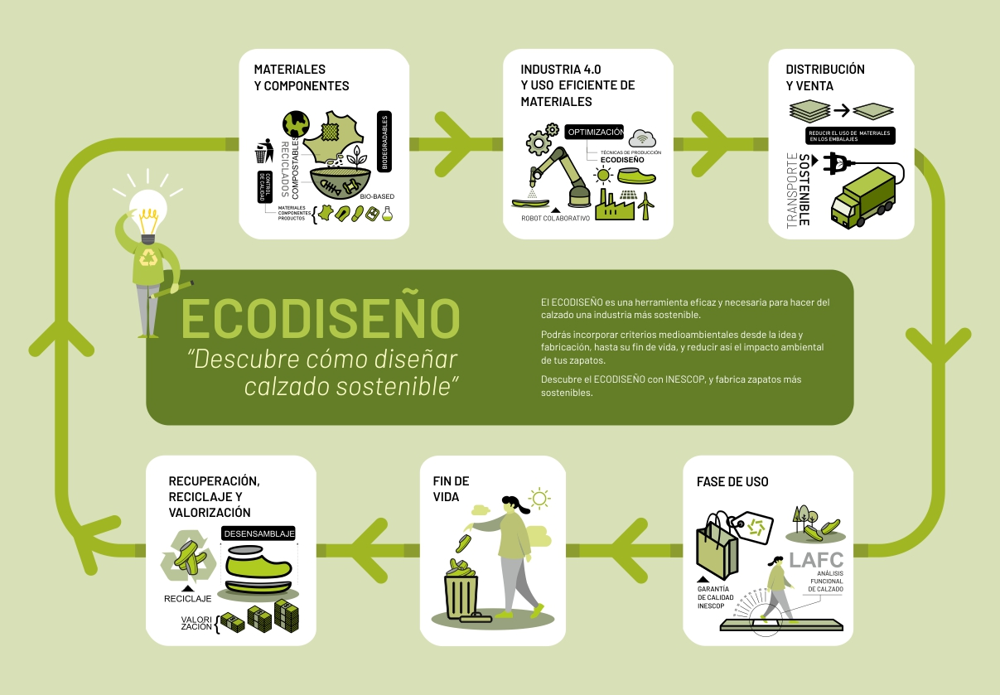
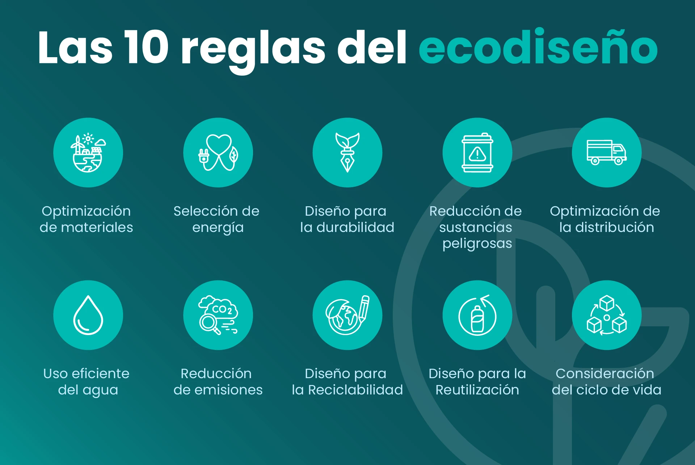

## Sesión 2 - Ecodiseño

**SOSTENIBILIDAD. UD3. DISEÑO Y PRODUCCIÓN SOSTENIBLES**

**Criterios: RA4.d**

---

## Artículo

Leemos el siguiente artículo de la web[**https://ecoesmas.com/ecodiseno-10-principios-10-ejemplos/** ](https://ecoesmas.com/ecodiseno-10-principios-10-ejemplos/)

[Fuente](https://www.inescop.es/en/news/news/484-el-ecodiseno-la-herramienta-mas-eficaz-para-hacer-del-calzado-una-industria-sostenible)

## 💻- Actividad 1

* Anota en tu Portfolio los criterios para hacer ecodiseño que sugiere el artículo
* Busca ejemplos en la web con los criterios encontrados
* Reflexiona acerca de uno de ellos
* ¿Qué ejemplo te ha resultado interesante y por qué?

## 1️⃣ Ecodiseño

> concepto y alcance

### 1) Qué es “diseño” y qué es “ecodiseño”

**Diseño (en sentido general)** es el proceso de definir cómo será un producto o servicio para que cumpla una función: forma, materiales, coste, estética, seguridad, ergonomía, facilidad de uso, fabricación, etc.

**Ecodiseño** es ese mismo proceso, pero incorporando de forma explícita un objetivo adicional:  **reducir el impacto ambiental y los riesgos para la salud a lo largo de todo el ciclo de vida** , sin perder la funcionalidad ni la calidad.
La diferencia clave es que el ecodiseño  **no es “un añadido verde al final”** : se integra desde el principio y condiciona decisiones técnicas (materiales, uniones, embalaje, mantenimiento, fin de vida).

En productos reales, **la mayor parte del impacto ambiental se “decide” en fases tempranas** (cuando eliges materiales, arquitectura, procesos, reparabilidad, logística y fin de vida). Una vez fabricado y distribuido, “arreglarlo” es caro y limitado.

**Ejemplo muy directo:**

* Si un diseñador decide pegar una batería con adhesivo fuerte dentro de un dispositivo, **ha decidido** que será difícil de reemplazar y reciclar.
* Si decide una carcasa con clips/tornillos y batería accesible, **ha decidido** que será reparable y tendrá mayor vida útil.

---

### 2) El impacto se decide temprano (y no al final)

En las primeras fases se toman decisiones con efecto “dominó”:

* **Materiales** (plástico virgen vs reciclado; aluminio vs acero; compuestos difíciles de separar).
* **Arquitectura del producto** (modular vs “todo integrado”).
* **Uniones** (tornillos, clips, encajes vs adhesivos permanentes).
* **Procesos de fabricación** (energía necesaria, mermas, sustancias usadas).
* **Durabilidad y mantenimiento** (repuestos, manuales, accesibilidad).
* **Embalaje y logística** (volumen, peso, protección, distribución).
* **Fin de vida** (facilidad de desmontaje, identificación de materiales, reciclabilidad).

Una forma de expresarlo:

* **Diseño tradicional** : “¿Funciona? ¿Cuánto cuesta? ¿Gusta?”
* **Ecodiseño** : “¿Funciona y además dura, se repara, se desmonta y genera menos impacto durante todo su ciclo?”

---

### 3) Relación con economía circular

> evitar residuo desde el origen

La **economía circular** busca mantener productos y materiales en uso el máximo tiempo posible, minimizando la extracción de recursos y el residuo.

El ecodiseño es una herramienta clave porque  **la circularidad no se improvisa** : si no diseñamos pensando en circularidad, luego es muy difícil reutilizar, reparar o reciclar.

**En economía circular, el residuo se considera un fallo de diseño.**

Por eso el ecodiseño intenta evitarlo “en el origen” mediante decisiones como:

* Diseñar para **durabilidad** (menos reemplazos).
* Diseñar para **reparación** (más vida útil).
* Diseñar para **reutilización / reacondicionamiento** (segunda vida).
* Diseñar para **desmontaje** (separar materiales).
* Diseñar para **reciclaje** (materiales y uniones compatibles).
* Diseñar para **uso compartido** o “producto como servicio” (más aprovechamiento del mismo producto).

---

## Ejemplos

> de distintos ámbitos:

**Ejemplo A — Dispositivo electrónico (móvil/altavoz/ratón)**

* **Diseño (solo funcional/coste):** carcasa pegada, batería sellada, mezcla de plásticos, sin repuestos.
* **Ecodiseño (circular):** tornillos estándar, batería reemplazable, piezas modulares (carcasa, placa, batería), plásticos identificados, manual de reparación.
  **Resultado circular:** reparación y reacondicionamiento viables; reciclaje más fácil.

**Ejemplo B — Botella de bebida**

* **Diseño:** plástico de varios tipos (etiqueta, tapón, botella) con adhesivos difíciles, envase más grueso de lo necesario.
* **Ecodiseño:** monomaterial o materiales compatibles, etiqueta fácil de retirar, reducción de gramaje sin perder resistencia, uso de rPET (reciclado).
  **Resultado circular:** mayor tasa de reciclaje y menos material.

**Ejemplo C — Silla de aula/oficina**

* **Diseño:** piezas pegadas o remachadas, tapicería difícil de sustituir, estructura no desmontable.
* **Ecodiseño:** estructura atornillada, tapizado sustituible, repuestos (ruedas, pistón, respaldo), materiales separados.
  **Resultado circular:** mantenimiento sencillo y alarga vida útil; al final se recicla mejor.

**Ejemplo D — Producto textil (sudadera)**

* **Diseño:** mezcla compleja (algodón + poliéster + elastano) sin información, tintes problemáticos, costuras que impiden separar elementos.
* **Ecodiseño:** composición simplificada, materiales con menor impacto, tintes más seguros, etiqueta clara, diseño para reparación (costuras accesibles).
  **Resultado circular:** reutilización, reparación y reciclaje más factibles.

**Ejemplo E — Servicio (no solo “objetos”)**

* **Diseño de servicio tradicional:** vender producto barato con recambios caros o inexistentes.
* **Ecodiseño aplicado al servicio:** modelo de **alquiler/servicio** con mantenimiento incluido (p. ej., iluminación como servicio, impresoras por uso), donde al proveedor le interesa que el producto dure, se repare y se recupere.
  **Resultado circular:** se maximiza uso, se reduce residuo y se recuperan componentes.

---

* “ **El impacto no se corrige al final: se diseña al principio.** ”
* “ **La economía circular empieza en el diseño.** ”
* “ **Residuo = decisión de diseño.** ”
* “ **Diseñar para reparar es diseñar para no tirar.** ”

---

## 💻Actividad 2

Añade el subtítulo a tu portfolio (Ejemplos) e incorpora imágenes y enlaces de los ejemplos anteriores realizados con ecodiseño

---

## **2️⃣ Principios clásicos de ecodiseño**

Los **principios clásicos de ecodiseño** recogen un conjunto de criterios prácticos que orientan las decisiones de diseño para  **reducir el impacto ambiental a lo largo de todo el ciclo de vida del producto** , desde la elección de materiales y procesos hasta su uso y fin de vida. No se trata de añadir elementos “ecológicos” al final, sino de  **diseñar mejor desde el inicio** , priorizando la eficiencia de recursos, la prolongación de la vida útil y la facilidad de reparación, reutilización y reciclaje. Aplicar estos principios permite prevenir residuos, reducir consumos y facilitar la circularidad sin comprometer la funcionalidad ni la calidad del producto.

* **Reducir** material y energía (lightweighting, eficiencia).
* **Durabilidad y fiabilidad** (vida útil, robustez).
* **Reparabilidad y mantenimiento** (acceso a piezas, modularidad).
* **Reutilización y remanufactura** (estandarización, piezas intercambiables).
* **Reciclabilidad** (monomateriales, facilidad de separación, etiquetado de materiales).
* **Sustitución de sustancias peligrosas** (materiales más seguros).
* **Diseño para desmontaje** (uniones reversibles, tornillos vs adhesivos).

[Fuente](https://vidacircular.lat/ecodiseno-innovacion-sostenible-para-un-futuro-mejor/)

---

## 💻Actividad 3

1. Relaciona cada **principio de ecodiseño** con el **ejemplo** que mejor lo representa.
2. Cada ejemplo corresponde  **solo a un principio principal** .
3. Hazlo en cualquier **documento o hoja de cálculo** y súbe captura al portfolio

### Principios

A. Reducir material y energía
B. Durabilidad y fiabilidad
C. Reparabilidad y mantenimiento
D. Reutilización y remanufactura
E. Reciclabilidad
F. Sustitución de sustancias peligrosas
G. Diseño para desmontaje

### Ejemplos

1. Un altavoz montado con tornillos estándar que permite separar carcasa, batería y placa electrónica.
2. Una botella fabricada con un único tipo de plástico y símbolo de reciclaje visible.
3. Una chaqueta diseñada con tejido resistente para varios años de uso.
4. Un cartucho de impresora preparado para ser rellenado varias veces.
5. Un portátil que consume menos energía para el mismo rendimiento.
6. Pinturas sin disolventes tóxicos utilizadas en muebles infantiles.
7. Un móvil con batería fácilmente sustituible por el usuario.

---

*Para ayudarte, tienes a continuación tienes  **ejemplos claros de cada principio de ecodiseño***

1) **Reducir material y energía**

* Un portátil más ligero que usa menos aluminio y una pantalla de bajo consumo.
* Botellas con menor gramaje de plástico manteniendo la resistencia.
* Iluminación LED frente a halógena para la misma cantidad de luz.

**Idea clave:** menos recursos para la misma función.

---

2) **Durabilidad y fiabilidad**

* Electrodomésticos con motores diseñados para más ciclos de uso.
* Mochilas con costuras reforzadas y cremalleras intercambiables.
* Herramientas profesionales pensadas para uso intensivo.

**Idea clave:** que el producto dure más y no falle prematuramente.

---

3) **Reparabilidad y mantenimiento**

* Móvil con batería y pantalla sustituibles sin pegamentos.
* Ordenadores con memoria RAM y disco accesibles.
* Electrodomésticos con repuestos disponibles durante años.

**Idea clave:** poder arreglar en lugar de tirar.

---

4) **Reutilización y remanufactura**

* Cartuchos de impresora diseñados para ser recargados.
* Palets industriales normalizados reutilizables.
* Equipos reacondicionados con piezas estándar.

**Idea clave:** volver a usar el producto o sus componentes.

---

5) **Reciclabilidad**

* Envases de un solo tipo de plástico claramente identificado.
* Latas de aluminio sin mezcla de materiales.
* Cajas de cartón sin laminados plásticos.

**Idea clave:** facilitar el reciclaje al final de la vida útil.

---

6) **Sustitución de sustancias peligrosas**

* Pinturas al agua en lugar de disolventes tóxicos.
* Eliminación de metales pesados en componentes electrónicos.
* Limpieza industrial con productos menos agresivos.

**Idea clave:** materiales más seguros para personas y medio ambiente.

---

7) **Diseño para desmontaje**

* Productos ensamblados con tornillos estándar.
* Muebles desmontables tipo kit.
* Aparatos donde se separan fácilmente carcasa, electrónica y batería.

**Idea clave:** desmontar sin romper para reparar o reciclar.

---

**Recuerda:** Cada uno de estos principios actúa  **antes de que exista el residuo** .

> Cuando un producto no se puede reparar, reutilizar o reciclar, normalmente  **no es un problema del usuario, sino del diseño** .

---

# 💻 Moodle & Portfolio

* Actualiza tu Portfolio, exporta en PDF y súbelo a Moodle
