## Sesión 3 - Análisis de ciclo de vida del producto (ACV)

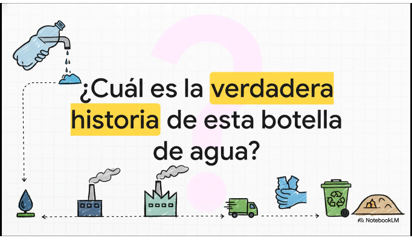

**Criterios:** RA4. Propón productos y servicios responsables teniendo en cuenta los principios de la economía circular.

(CE e)  Se ha analizado el ciclo de vida del producto.

**Objetivo de contenido:** entender el enfoque de ciclo de vida y realizar un análisis estructurado de impactos por etapas.

**Contenidos:**

* **1 Ciclo de vida: enfoque “de la cuna a la tumba” y “de la cuna a la cuna”**
  * Diferencias entre alcance lineal y circular.
  * Límites del sistema: qué se incluye y qué no.
* **2 Etapas del ciclo de vida (mapa estándar)**
  * Extracción y procesado de materias primas.
  * Fabricación y ensamblaje.
  * Distribución y logística.
  * Uso y mantenimiento (consumos, consumibles, fallos).
  * Fin de vida: reutilización, reparación, reciclaje, valorización, eliminación.
* **3 Conceptos clave del análisis**
  * **Unidad funcional** (para comparar alternativas de forma justa).
  * **Inventario** (inputs/outputs: materiales, energía, emisiones, residuos).
  * **Puntos críticos / hotspots** : dónde se concentra el impacto.
* **4 Indicadores ambientales habituales en ACV (a nivel didáctico)**
  * Huella de carbono (CO₂e), consumo energético, consumo de agua, residuos, toxicidad/sustancias.
* **5 Uso del ACV para orientar ecodiseño**
  * Cómo el análisis revela decisiones de diseño con mayor retorno (durabilidad, eficiencia en uso, logística, materiales).

## INTRODUCCIÓN

En esta sesión vamos a trabajar el **análisis del ciclo de vida del producto** como una herramienta práctica para tomar decisiones responsables desde la economía circular. 

Partiremos de ejemplos cercanos —como un ordenador, una botella reutilizable, una prenda de ropa o un servicio digital— para comparar enfoques **lineales (“de la cuna a la tumba”)** frente a  **circulares (“de la cuna a la cuna”)** , delimitando qué etapas y procesos entran realmente en el análisis.

* Recorreremos el mapa estándar del ciclo de vida, desde la extracción de materias primas hasta el fin de vida, identificando **puntos críticos de impacto** mediante indicadores sencillos como huella de carbono, energía o residuos.
* El objetivo no es calcular con precisión industrial, sino **entender dónde se concentra el impacto** y cómo esa información permite orientar decisiones de  **ecodiseño** : elegir materiales, mejorar la durabilidad, optimizar la logística o reducir consumos en la fase de uso, justificando propuestas de productos y servicios más responsables.

---

## 1️⃣Ciclo de vida

> **“de la cuna a la tumba” y “de la cuna a la cuna”**

En el enfoque **“de la cuna a la tumba”** pensamos el producto como una línea: nace (se fabrica), se usa y termina como residuo. Es el modelo típico de muchos bienes de consumo: compras, usas y tiras. Ejemplo rápido: unos auriculares baratos que, cuando falla un cable, no se reparan y acaban en basura electrónica.

En cambio, **“de la cuna a la cuna”** plantea que el final no sea un vertedero, sino un  **nuevo inicio** : reutilizar, reparar, remanufacturar o reciclar con calidad (sin “degradar” el material hasta que ya no sirva). Por ejemplo, una botella de aluminio diseñada para durar años o un portátil modular donde cambias batería/SSD y alargas la vida útil.

Aquí es clave hablar de  **límites del sistema** : qué metemos en el análisis y qué dejamos fuera. Si analizas una camiseta, ¿incluyes el cultivo del algodón, el tinte, el transporte, los lavados durante años y el fin de vida? Si analizas un servicio digital (streaming), ¿cuentas centros de datos, redes, el dispositivo del usuario y la electricidad? Definir límites evita comparaciones “tramposas”.

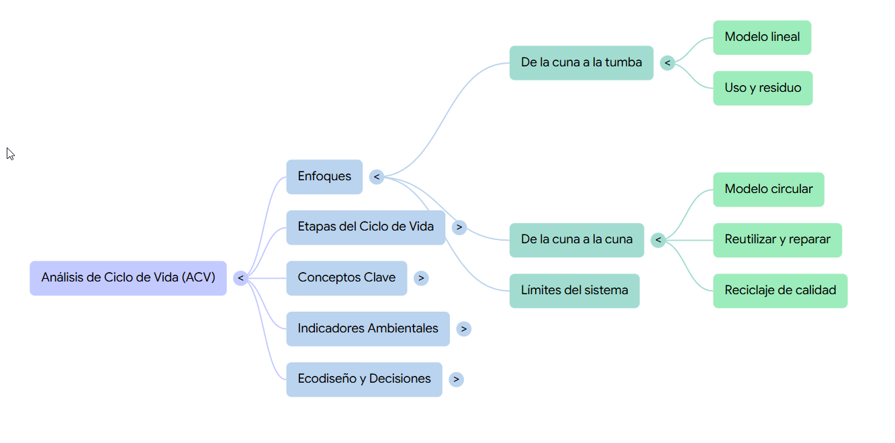

---

## 2️⃣Etapas

> del ciclo de vida

Primero dibujamos el mapa estándar:  **extracción y procesado** ,  **fabricación** ,  **distribución** , **uso y mantenimiento** y  **fin de vida** . Lo importante es entender que el impacto no está solo en “fabricar”: a veces se concentra en el **uso** (electrodomésticos, calefacción) o en la **logística** (productos que viajan miles de km o requieren frío).

En **extracción y procesado** aparecen impactos fuertes: minería de metales, petróleo para plásticos, tala y procesado de madera, agua y fertilizantes en agricultura. Un móvil, por ejemplo, acumula impactos por metales y tierras raras; una hamburguesa industrial tiene mucha huella en producción de pienso, agua y emisiones asociadas.

En **uso y mantenimiento** entran consumos y “consumibles”: electricidad, agua, recambios, cartuchos, detergentes, baterías, fallos. Una impresora puede “parecer barata” pero disparar residuos por cartuchos; un coche eléctrico reduce emisiones en uso según la electricidad del mix; y en fin de vida la diferencia la marca si hay **reutilización, reparación, reciclaje** real o simple eliminación.

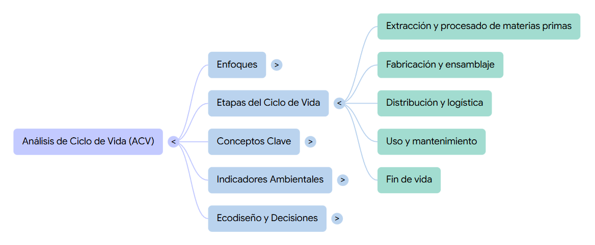

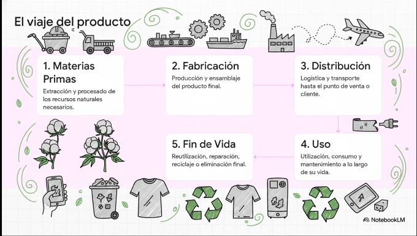

---

## 3️⃣Conceptos

clave para el análisis

La **unidad funcional** es el truco para comparar con justicia: no comparamos “productos” sino  **la función que prestan** . Ejemplo: no es “una bombilla”, es “producir X lúmenes durante Y horas”. No es “una botella”, es “transportar 1 litro de bebida durante 1 año” o “100 usos”. Esto evita que gane el que “parece” mejor pero ofrece menos servicio.

El **inventario (LCI)** es listar entradas y salidas: materiales, energía, agua, emisiones, residuos, transporte, embalajes, piezas sustituidas… No hace falta nivel industrial: a nivel didáctico podemos usar aproximaciones (kWh estimados, km de transporte, masa de materiales) para aprender el método y, sobre todo, ver  **qué variables mueven la aguja** .

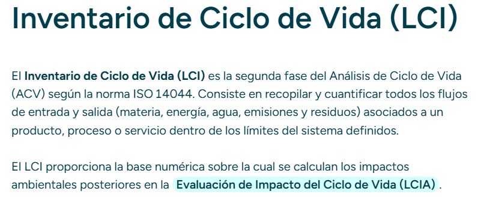

*[Fuente](https://www.manglai.io/glossary/inventario-de-ciclo-de-vida)*

Los **hotspots** son los puntos donde se concentra el impacto. A veces sorprenden: en una prenda, el hotspot puede ser el **lavado y secado** si se hace muy a menudo; en un portátil, puede ser  **la fabricación** ; en un servicio digital, el hotspot puede ser **el consumo energético** de centros de datos/red o el dispositivo. Identificar hotspots sirve para decidir “dónde actuar primero”.

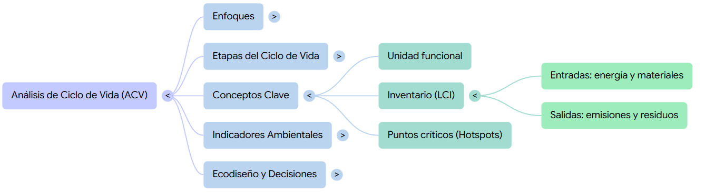

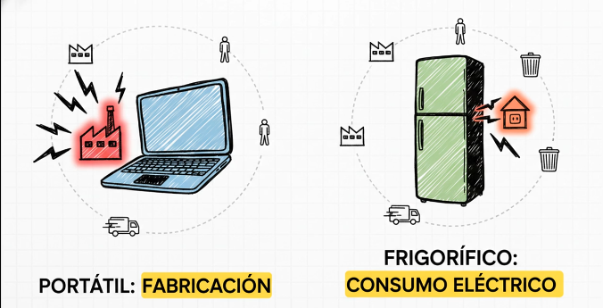

---

## 4️⃣Indicadores ambientales habituales en ACV (nivel didáctico)

La **huella de carbono (CO₂e)** nos permite hablar de emisiones a lo largo del ciclo de vida, no solo en el uso. Por ejemplo, un coche puede emitir menos en uso pero tener una fabricación más intensa; un producto importado por avión suele disparar CO₂e por transporte; y una dieta con más carne suele aumentar CO₂e por la cadena alimentaria.

El **consumo energético** (kWh) ayuda a ver eficiencia y dependencia de fuentes. Un electrodoméstico eficiente reduce impactos en la etapa de uso; un servidor o un centro de datos se evalúa mucho por su energía y por si usa renovables. En clase podemos comparar “energía total estimada” entre alternativas (ej. portátil reparable vs. reemplazo frecuente).

El **agua, residuos y toxicidad/sustancias** completan el cuadro. Agua: clave en agricultura y textiles (algodón) o procesos industriales. Residuos: embalajes, piezas sustituidas, fin de vida. Sustancias: tintes, retardantes de llama, disolventes, baterías… Aquí se entiende por qué el ecodiseño no es solo “reciclar”, sino también **evitar materiales problemáticos** y facilitar separación segura.

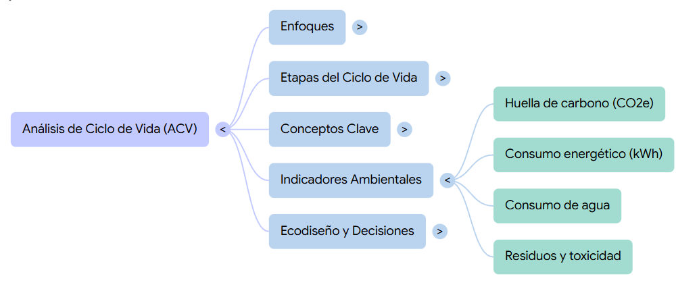

---

## 5️⃣Uso del ACV para orientar ecodiseño

El ACV sirve para priorizar decisiones con más retorno: si el hotspot está en  **uso** , trabajas eficiencia (consumo eléctrico, modos ahorro, consumibles). Si el hotspot está en  **fabricación** , trabajas materiales, procesos, reducir masa, aumentar reciclado, y sobre todo **alargar vida útil** para amortizar el impacto inicial.

En ecodiseño aparecen palancas claras: **durabilidad** (que no falle pronto), **reparabilidad** (piezas accesibles, tornillos estándar, recambios), **modularidad** (cambiar solo el módulo), y **logística** (menos volumen, embalaje mínimo, fabricación cercana). Ejemplo: una silla diseñada para desmontarse y cambiar solo el asiento; o un smartphone con batería reemplazable y actualizaciones garantizadas.

La clave final es conectar “datos” con “decisiones”: el ACV no es un informe para archivar, es un mapa para elegir mejor. Si detectas que el embalaje aporta poco, no te obsesionas con él; si el transporte o el uso dominan, atacas ahí. Con esto el alumnado puede justificar propuestas de productos/servicios responsables con argumentos técnicos:  **qué cambias, por qué y qué impacto esperas reducir** .

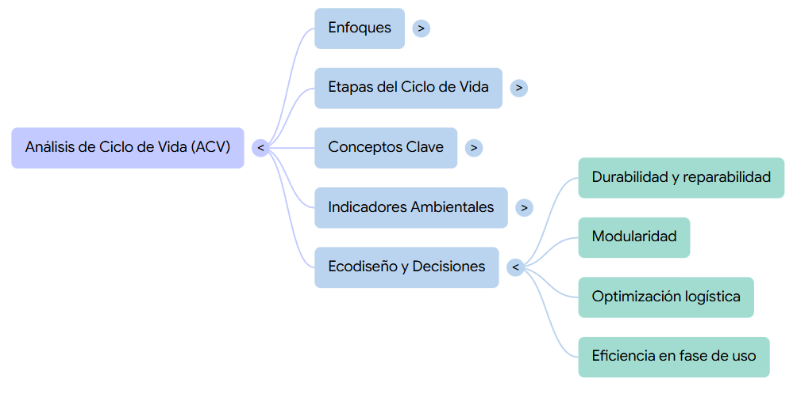

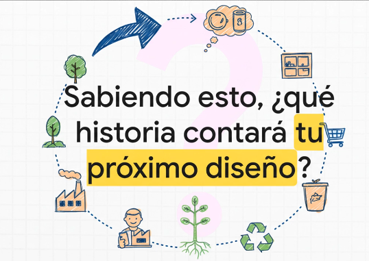

# 💻- Actividad

**ACV Express: comparar 3 alternativas y detectar hotspots**

Compara **3 opciones** para la misma *unidad funcional* y decide cuál es más responsable según  **CO₂e, energía, agua y residuos** , justificando **hotspots** y  **mejoras de ecodiseño** .

!!! success "Haz una copia en tu drive"

    Haz una copia de esta hoja de cálculo en tu Google Drive para realizar la tarea (**[ENLACE](https://docs.google.com/spreadsheets/d/1DXBjn5WAbO3AJoUMRjaqycyENeab1cv3/copy)**)

    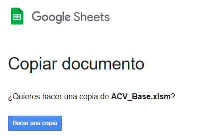

    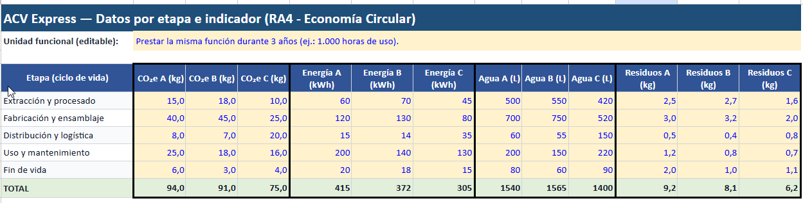

!!! note "Recuerda"

    La**unidad funcional** es la**referencia común** que se usa en el análisis del ciclo de vida para  **comparar alternativas de forma justa** , porque define  **qué función se presta** , **en qué cantidad** y  **durante cuánto tiempo** . No se comparan productos “tal cual”, sino  **el servicio que ofrecen** .

**Ejemplos de unidad funcional:**

* **Iluminación:** *“Proporcionar 800 lúmenes durante 10.000 horas”* (no “una bombilla”).
* **Envases:** *“Transportar 1 litro de bebida durante 100 usos”* (no “una botella”).
* **Movilidad:** *“Desplazar una persona 1 km”* o  *“10.000 km al año”* .
* **Tecnología:**  *“Disponer de un portátil funcional durante 5 años para tareas ofimáticas”* .
* **Textil:**  *“Vestir una prenda durante 50 usos/lavados”* .

---

### **Hoja 1 — DATOS**

Tabla con filas = **etapas del ciclo de vida** y columnas = **indicadores** para cada alternativa.

**Filas (A2:A6):**

1. Extracción/procesado
2. Fabricación/ensamblaje
3. Distribución/logística
4. Uso/mantenimiento
5. Fin de vida

**Alternativas (tres columnas por indicador):**

* **A: “Producto barato”**
* **B: “Producto reparable”**
* **C: “Servicio/alquiler”** (o “remanufacturado”)

Ejemplo de columnas:

* CO2e_A | CO2e_B | CO2e_C
* kWh_A | kWh_B | kWh_C
* Agua_A | Agua_B | Agua_C
* Residuos_A | Residuos_B | Residuos_C

**ESCOGE UNA UNIDAD FUNCIONAL (Cada alumno/a diferente)**

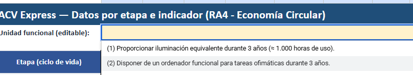

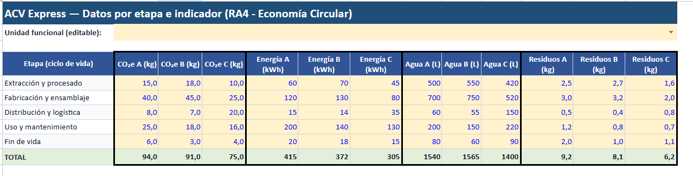

- Pega las tres opciones:

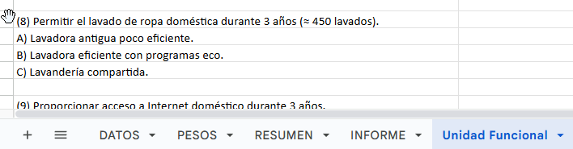

---

## INSTRUCCIONES DE LA TAREA

Con la hoja **ACV_Express_Base.xlsx** que te pasé, la tarea se hace:

## Paso 0 — Abrir y entender la estructura

El archivo tiene 4 pestañas:

* **DATOS** → donde están los valores por etapa e indicador (editable).
* **PESOS** → donde se ajustan los pesos del índice (editable).
* **RESUMEN** → donde salen resultados automáticos (no tocar).
* **INFORME** → plantilla para redactar el análisis (rellenar).

---

## Paso 1 — Elegir la unidad funcional

1. Ve a la hoja  **INFORME** .
2. Localiza la celda de **“Unidad funcional (editable)”**
3. Pega una de tus opciones, por ejemplo:
   `(2) Disponer de un ordenador funcional para tareas ofimáticas durante 3 años.`

**Regla:** la unidad funcional debe implicar *misma función* + *periodo (3 años)* + (si quieres)  *cantidad aproximada* .

---

## Paso 2 — (Opcional) Cambiar los datos del inventario

Si quieres “JUGAR” con escenarios:

1. Ve a la hoja  **DATOS** .
2. Edita **solo** el bloque de celdas amarillas **B6:M10** (valores por etapa).
   * Filas = etapas del ciclo de vida (Extracción, Fabricación, Distribución, Uso, Fin de vida)
   * Columnas = indicadores por alternativa (A, B, C)

**Importante para que no se rompa el ejercicio:**

* No borres títulos ni cambies nombres de etapas.
* Mantén valores numéricos (no texto).
* No cambies unidades (CO₂e, kWh, L, kg).

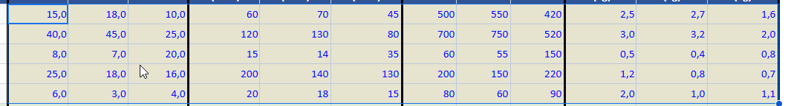

---

## Paso 3 — Ajustar los pesos del índice

1. Ve a la hoja  **PESOS** .
2. Cambia los pesos en **B4:B7** (celdas editables):
   * CO₂e
   * Energía (kWh)
   * Agua (L)
   * Residuos (kg)

**Regla obligatoria:** la suma debe ser **1,00** (100%).
Ejemplo típico: 0,40 / 0,30 / 0,20 / 0,10

- JUSTIFICA TU ELECCIÓN:

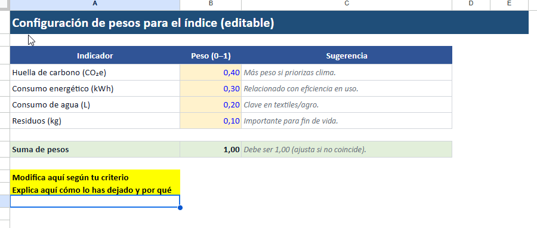

---

## Paso 4 — Ver resultados automáticos (sin tocar fórmulas)

1. Ve a la hoja  **RESUMEN** .
   Aquí ya aparecen calculados automáticamente:

* **Totales por alternativa** (A, B, C) para cada indicador.
* **Hotspots Top1 y Top2** por alternativa e indicador (la etapa que más pesa).
* **Normalización** (para comparar indicadores con unidades distintas).
* **Índice ponderado final** y **ranking** de alternativas.

NO se debe modificar esta hoja: solo leerla y usarla para justificar.

---

## Paso 5 — Hacer el análisis y redactar el informe

1. Ve a  **INFORME** .
2. Rellena los apartados (están pensados para copiar/pegar datos del RESUMEN):

**Lo que deben escribir (mínimo):**

* **Ganadora según índice final:** A / B / C
* **Dos datos numéricos** que lo justifiquen (ej.: “B tiene menor CO₂e total y menor energía total”).
* **Hotspot principal** (qué etapa concentra el impacto) y su lectura:
  * Ej.: “En A el hotspot es USO → conviene mejorar eficiencia o consumibles”.
* **2 propuestas de ecodiseño** coherentes con el hotspot:
  * Durabilidad / reparabilidad / logística / materiales / eficiencia en uso / fin de vida.
* **Trade-off** (algo que mejora y algo que empeora) si lo hay:
  * Ej.: “B reduce residuos pero sube fabricación”.

## VIDEO-EXPLICACIÓN

* [Enlace a la video explicación
  ](https://drive.google.com/file/d/1kW5LoHuw0-hZjawQhkEbuAONR02s9ce7/view?usp=sharing)

---

## Paso 6 — Entrega

Según cómo lo pidas:

* Debes incrustar la **hoja de cálculo** en tu portfolio con **permisos** de lectura
* * Recuerda: clic en insertar
* Añade además algunas capturas de pantalla
* La tarea se sube en las horas de clase, y la audio descripción se realiza en casa y se actualiza en casa.

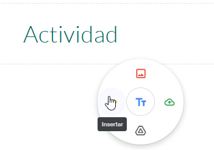

---

### AUDIO DESCRIPCIÓN

> Sube también una audio descripción de tus CONCLUSIONES al portfolio

* Sube un audio a tu Portfolio (puedes grabarte en Whatsapp por ejemplo y compartir por Drive o Correo, por ejemplo)

<iframe width="1612" height="907" src="https://www.youtube.com/embed/EOs8v72c24g" title="Cómo compartir audios de WhatsApp en Google Drive" frameborder="0" allow="accelerometer; autoplay; clipboard-write; encrypted-media; gyroscope; picture-in-picture; web-share" referrerpolicy="strict-origin-when-cross-origin" allowfullscreen></iframe>

# 💻 Moodle & Portfolio

* Sube la tarea a Moodle e incrusta y la hoja de cálculo (captura de la pestaña INFORME)  a tu **Portfolio**
